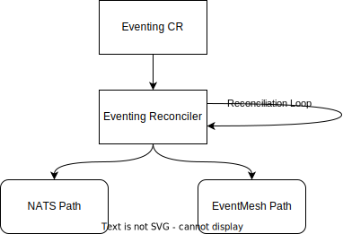

# Eventing Manager

This module ships the Eventing Manager. Once this module is enabled, it provides the functionality to send and receive events.

## Module Lifecycle

Upon starting the Eventing Manager, the controller (following the [Kubebuilder concept](link)) creates, watches and reconciles the following resources:

- ConfigMap
- Secret
- Service
- Stateful Set
- Destination Rule
- Pod Disruption Budget

The Eventing Manager reactes to changes of the Eventing CR to adapt the resources mentioned above to the desired state. For details how to configure Eventing using the CR, visit the [Configuration documentation](02-configuration.md).

## Backend

The Eventing Manager supports switching between two different backends. [NATS](https://nats.io/about/), an open source messaging system and [EventMesh](https://www.sap.com/germany/products/technology-platform/integration-suite/capabilities/event-mesh.html) a SAP solution for event-based architecture.

### NATS

If you want to use the Eventing Manager with NATS backend, you need to deploy the [NATS Module](https://github.com/kyma-project/nats-manager).

More information about the possible configuration of the Eventing Manager using NATS backend, refer to the [NATS backend configuration](link).

### SAP EventMesh

If you want to use the Eventing Manager with EventMesh backend, you need to deploy the [API-Gateway Module](https://github.com/kyma-project/api-gateway).

More information about the possible configuration of the Eventing Manager using EventMesh backend, refer to the [EventMesh backend configuration](link).

## Removing the Module

The module cannot be removed as long as subscription CRs exist. After the user cleans up all the subscriptions, the Eventing Module can be removed. The module takes care of cleaning up all resources owned by it.
